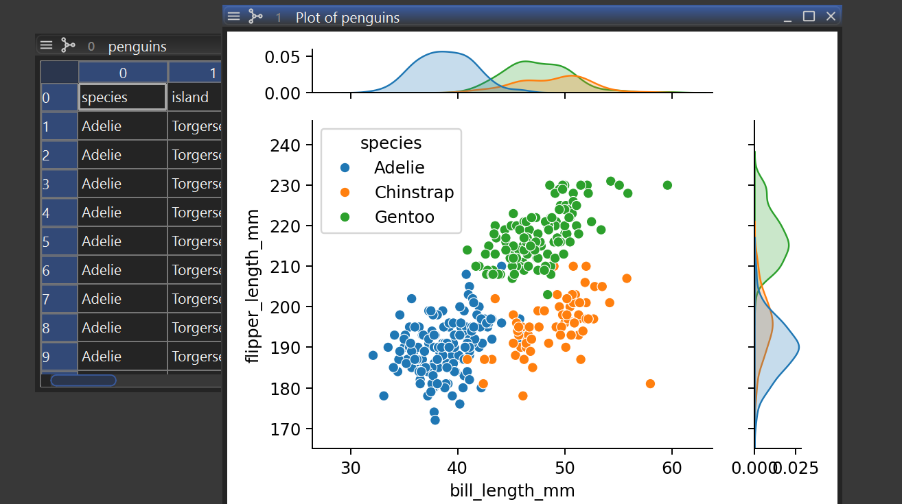
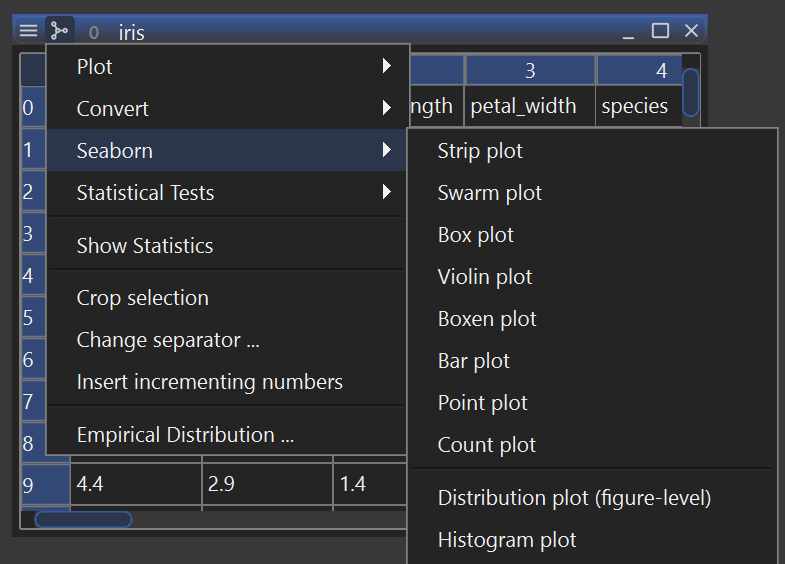

# himena-seaborn

[](https://pypi.org/project/himena-seaborn)
[](https://pypi.org/project/himena-seaborn)
[](https://codecov.io/gh/hanjinliu/himena-seaborn)

-----

Running [`seaborn`](https://github.com/mwaskom/seaborn) functions inside [`himena`](https://github.com/hanjinliu/himena).



## Installation

The easiest way to install `himena-seaborn` is via himena's `--get` option.

```shell
himena <my-profile> --get himena-seaborn
```

Alternatively, you can install `himena-seaborn` to your Python environment via pip, and
then install it to your himena profile.

```shell
pip install himena-seaborn
himena <my-profile> --install himena-seaborn
```

## Usage

A "Seaborn" menu will be added to the table and dataframe menus.


